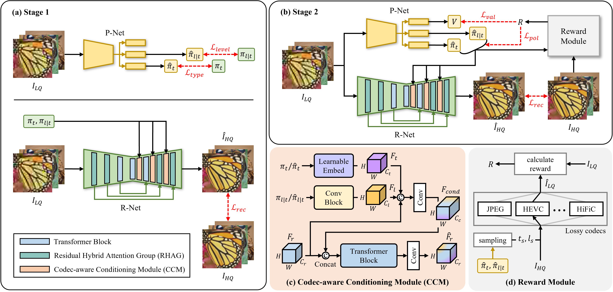

# [AAAI'26] UCIR-CARL

This repository is the official PyTorch implementation of "Universal Compressed Image Restoration via Codec-Aware Conditioning with Reinforcement Learning," The 40th Annual AAAI Conference on Artificial Intelligence (AAAI'26), Singapore, 2026

<h1>Universal Compressed Image Restoration via Codec-Aware Conditioning with Reinforcement Learning</h1>

[Changwoo Han](https://sites.google.com/view/deepiplab/members/students)1*,
[Hongil Kim](https://sites.google.com/view/deepiplab/members/students)1*,
Donghyun Kim2,
Sung-Chang Lim2,
[Seung-Won Jung](https://sites.google.com/view/deepiplab/members/project-definition)1&#x2709;

1Korea University DIP Lab, 2ETRI Media Coding Research Section

<small>* Equal contribution, &#x2709; Corresponding authors</small>

---

  

 

  <a href="https://drive.google.com/file/d/1P1I7r6wHU8s3-iPl0mz-sWq-SIwqWOy2/view?usp=drive_link" target="_blank">supplementary material</a> •
  <a href="#introduction">introduction</a> •
  <a href="#datasets">datasets</a> •
  <a href="#architecture">architecture</a> •
  <a href="#results">results</a>

---

## 🔥 News

- **[2025-11-08]** 📝 Our UCIR-CARL paper has been accepted by **AAAI 2026**!
- **[Coming Soon]** 🚧 Code and models will be released soon. Stay tuned!

## Introduction

We address the task of universal compressed image restoration, which involves recovering high-quality images degraded by a wide range of codecs and compression levels. While prior methods have made significant progress, they typically target specific degradation types and struggle to generalize across both traditional and learning-based codecs. To overcome this limitation, we propose a unified framework that leverages codec-aware conditioning and reinforcement learning-based fine-tuning. Specifically, we introduce a conditioning module that encodes both codec type and compression level, enabling the restoration network to adapt its behavior to diverse degradation settings. To further improve generalization, we incorporate reward-based objectives during fine-tuning, providing complementary signals that enhance training across both conventional and learned compression schemes. Experimental results demonstrate the effectiveness of our method in restoring images across a wide range of compression artifacts and scenarios.

## Datasets
* DIV2K
* Flickr2K

## Architecture
* -

## Results
* -

## License
This code is released under the MIT License.

## Citation
If you find this work helpful, please consider citing:
